# archipilot – Enterprise Architecture Copilot

[](LICENSE)
[](https://github.com/enzomar/archipilot/actions/workflows/ci.yml)
[](https://code.visualstudio.com/)
[](https://github.com/enzomar/archipilot/issues)
[](https://github.com/enzomar/archipilot/stargazers)

A VS Code Chat Participant extension that turns your Obsidian architecture vaults into an interactive, TOGAF-aligned Enterprise Architecture assistant — powered by GitHub Copilot.

<p align="center">
  <em>Ask architecture questions, resolve decisions, update vault documents — all from Copilot Chat.</em>
</p>

## How It Works

```mermaid
flowchart LR
  subgraph You["🧑‍💼 Enterprise Architect"]
    Chat["Copilot Chat<br/>@architect /command"]
    Sidebar["Sidebar<br/>Vault Explorer · Health"]
    Palette["Command Palette<br/>Quick exports"]
  end

  subgraph archipilot["⚙️ archipilot Extension"]
    Router["Command Router"]
    Prompts["TOGAF Prompt Builder"]
    Core["Core Engine<br/>Parser · Validator · Exporter"]
    Updater["File Updater<br/>Diff · Backup · Audit"]
  end

  subgraph Vault["📂 Obsidian Vault"]
    ADM["TOGAF ADM Files<br/>A1–X5 (.md)"]
    YAML["YAML Front Matter<br/>status · owner · version"]
    Links["WikiLinks<br/>Cross-references"]
    Exports["exports/<br/>ArchiMate · Draw.io"]
  end

  Chat --> Router
  Sidebar --> Router
  Palette --> Router
  Router --> Prompts
  Prompts -->|"LLM via Copilot"| Core
  Core --> Updater
  Updater -->|"read / write"| Vault
  Core -->|"read-only scans"| Vault

  style You fill:#f0f4ff,stroke:#6366f1
  style archipilot fill:#fefce8,stroke:#ca8a04
  style Vault fill:#ecfdf5,stroke:#059669
```



**Typical workflow:**
1. **Ask** — Type `@architect /status` to see your vault's health dashboard
2. **Analyze** — Use `/analyze` or `/todo` to find gaps, blockers, and priorities
3. **Decide** — Run `/decide` for structured pros/cons on open decisions
4. **Update** — Apply changes with `/update` — diff preview + confirmation + audit log
5. **Export** — Generate ArchiMate XML, Draw.io diagrams, C4 models, or Gantt timelines
6. **Govern** — Use `/review` and `/gate` for quality checks and phase gate assessments

## Features

- **`@architect`** – Chat participant available in Copilot Chat
- **Vault-aware** – Reads your Obsidian vault as authoritative context
- **TOGAF governance** – Enforces architecture discipline and traceability
- **Multi-project** – Switch between different vault folders instantly

### Commands

| Command | Description |
|---------|-------------|
| `@architect` | Ask any architecture question (auto-mode) |
| `@architect /analyze` | Architecture impact analysis (read-only) |
| `@architect /decide` | Decision support with structured reasoning |
| `@architect /update` | Modify vault documents with governance |
| `@architect /status` | Vault overview and decision status |
| `@architect /switch` | Switch to a different vault folder |
| `@architect /c4` | Generate C4 model diagrams (Mermaid) |
| `@architect /sizing` | Capacity & cost sizing analysis |
| `@architect /timeline` | Generate Gantt timeline (Mermaid) |
| `@architect /archimate` | Export vault to ArchiMate 3.2 Open Exchange XML |
| `@architect /drawio` | Export vault to Draw.io diagrams (As-Is, Target, Migration) |
| `@architect /todo` | List next TOGAF action items from the vault |
| `@architect /adr <title>` | Record a new Architecture Decision in the decision log |
| `@architect /diagram` | Generate a Mermaid context diagram for the active file |
| `@architect /graph` | Visualize the full vault as a dependency graph |
| `@architect /new` | Scaffold a new empty TOGAF vault |

### Palette Commands

| Command | Description |
|---------|-------------|
| `archipilot: Export Vault to ArchiMate (XML)` | Quick-export the active vault without opening chat |
| `archipilot: Export Vault to Draw.io` | Quick-export As-Is / Target / Migration diagrams without opening chat |
| `archipilot: Record Architecture Decision` | Open ADR input box without using chat |
| `archipilot: Generate Context Diagram` | Insert a Mermaid diagram for the active file without using chat |
| `archipilot: Show Vault Graph` | Generate and open `Vault-Graph.mermaid` without using chat |
| `archipilot: Open in Split Preview` | Open a vault file side-by-side with its Markdown preview (sidebar icon) |

### Command Cheat Sheet

A quick reference for every `@architect` command — print this or keep it open while working.

| Command | What it does | Modifies files? |
|---------|-------------|:---:|
| `@architect` | Free-form architecture Q&A | No |
| `/analyze` | Impact analysis of a proposed change | No |
| `/decide` | Structured pros/cons for an open decision | No |
| `/status` | Vault health dashboard (maturity, risks, gaps) | No |
| `/todo` | Prioritised TOGAF action items from the vault | No |
| `/review` | Automated quality & completeness review | No |
| `/gate <phase>` | Phase gate readiness checklist | No |
| `/impact <ID>` | Cross-vault impact chain for a TOGAF ID | No |
| `/update <instruction>` | Modify vault files (with diff preview) | **Yes** |
| `/adr <title>` | Record a new Architecture Decision | **Yes** |
| `/diagram` | Insert a Mermaid context diagram in active file | **Yes** |
| `/graph` | Generate full vault dependency graph | **Yes** |
| `/c4` | Generate C4 model diagram (Mermaid) | No |
| `/sizing` | Capacity & cost estimation | No |
| `/timeline` | Gantt chart from roadmap | No |
| `/archimate` | Export to ArchiMate 3.2 XML | **Yes** |
| `/drawio` | Export to Draw.io (As-Is / Target / Migration) | **Yes** |
| `/new <name>` | Scaffold a new TOGAF vault | **Yes** |
| `/switch` | Switch active vault | No |

**Flags:** Append `--dry-run` or `--preview` to any `/update` command to preview changes without writing. Append `--no-analysis` to `/archimate`, `/drawio`, or `/todo` to skip AI commentary.

## Usage Examples

Below are practical examples for every command. Just type these in Copilot Chat — the agent reads your vault and responds accordingly.

### `@architect /adr` — Record an Architecture Decision

Create a new Architecture Decision Record (ADR) entry directly from chat — no need to open or edit `X1_ADR_Decision_Log.md` manually.

```
@architect /adr Use PostgreSQL for transactional data
@architect /adr Adopt an API Gateway as the single entry point for all external traffic
@architect /adr Self-host the LLM instead of using a cloud API
@architect /adr Defer MCP integration to Phase 5
```

**What it does:**
1. Determines the next available ADR ID (e.g. `AD-05`)
2. Appends a structured entry to `X1_ADR_Decision_Log.md` with Status: `🟡 Proposed`, date, and template sections (Context / Options / Decision)
3. Returns a confirmation with the new ID and a ready-to-use follow-up prompt
4. Refreshes the Architecture Health sidebar to reflect the new pending decision

> 💡 Combine with `/decide`: after recording, use `@architect /decide AD-05 Use PostgreSQL` to get AI-driven analysis of options.

---

### `@architect /diagram` — Context Diagram for Active File

Generate a Mermaid context diagram from the `[[WikiLinks]]` in the file currently open in your editor.

```
@architect /diagram
```

**What it does:**
1. Reads the active Markdown file
2. Extracts all `[[WikiLinks]]` (ignoring aliases and anchors)
3. Generates a `flowchart LR` Mermaid diagram with the current file at the centre
4. Inserts the diagram block at the bottom of the file under a `## Context Diagram` heading
5. Renders a preview in the chat response

**Example output (for `C1_Application_Architecture.md`):**


> 💡 Open any vault file in the editor, then run `/diagram` — no extra arguments needed.

---

### `@architect /graph` — Full Vault Dependency Graph

Visualize the entire vault as a Mermaid dependency graph — every file as a node, every `[[WikiLink]]` as an edge.

```
@architect /graph
```

**What it does:**
1. Scans all markdown files in the active vault
2. Builds a node + edge list from all `[[WikiLinks]]` between vault files
3. Generates a `flowchart LR` Mermaid diagram
4. Saves the output to `Vault-Graph.mermaid` in your vault root
5. Previews the graph (truncated) in chat and provides a link to the saved file

**Tips:**
- Install the [Mermaid Preview](https://marketplace.visualstudio.com/items?itemName=bierner.markdown-mermaid) extension to render `Vault-Graph.mermaid` visually
- Files with many outgoing links indicate **highly-coupled artifacts** — review for traceability
- Files with zero incoming links are **orphaned** — the Architecture Health view flags these too

---

### `@architect /archimate` — ArchiMate Export

Export your vault to an ArchiMate 3.2 Open Exchange Format (OEFF) XML file. The exported model is importable by **Archi**, **BiZZdesign**, **Sparx EA**, **ADOIT**, and any tool supporting the ArchiMate Exchange standard.

```
@architect /archimate
@architect /archimate Analyze this export for completeness
@architect /archimate Focus on cross-layer traceability gaps
@architect /archimate --no-analysis   (export only, skip AI analysis)
```

**What gets exported:**
- Phase B → Business Layer (processes, capabilities, functions)
- Phase C → Application Layer (components, interfaces, data objects)
- Phase D → Technology Layer (nodes, system software, devices)
- Phase E → Implementation & Migration (SBB deliverables, work packages)
- Preliminary → Motivation (principles)
- Requirements → Motivation (requirements, constraints)
- Decision Log → Motivation (assessments)
- Risk Register → Motivation (assessments)
- Stakeholders → Motivation (stakeholders, drivers)

Relationships are extracted from Mermaid diagrams, table columns, and cross-layer name matching. Five views are auto-generated: Full Layered, Business & Motivation, Application, Technology, and Implementation.

### `@architect /drawio` — Draw.io Architecture Diagrams

Export your vault to Draw.io (diagrams.net) XML files with three architectural views:

- **As-Is** — Current-state architecture extracted from baseline sections
- **Target** — Future-state architecture extracted from target sections
- **Migration** — Color-coded overlay showing what changes between states

```
@architect /drawio
@architect /drawio Analyze migration classification accuracy
@architect /drawio Focus on cross-layer gaps in the target state
@architect /drawio --no-analysis   (export only, skip AI analysis)
```

**Migration Color Legend:**

| Color | Meaning | Description |
|-------|---------|-------------|
| 🔴 Red | **Remove** | Exists in As-Is but not in Target — to be retired |
| 🟢 Green | **Add** | New in Target — to be implemented |
| 🔵 Blue | **Keep** | Unchanged — carried over from As-Is to Target |

**Output files** (saved to `exports/drawio/` in your vault):
- Combined multi-tab `.drawio` file (all 3 views)
- Individual `.drawio` files for As-Is, Target, and Migration

Open in VS Code (with the "Draw.io Integration" extension), diagrams.net, or Confluence.

### `@architect /todo` — TOGAF Action Items

Scan the vault and extract a prioritised list of next actions from a TOGAF perspective. The extractor scans:

- **Open Decisions** — from X1_ADR_Decision_Log.md
- **Open Risks** — from X2_Risk_Issue_Register.md
- **Open Questions** — from X3_Open_Questions.md
- **Pending Work Packages & Milestones** — from F1_Architecture_Roadmap.md
- **Open Requirements** — from R1_Architecture_Requirements.md (FR + NFR)
- **Incomplete Compliance Checks** — from G1_Compliance_Assessment.md
- **Pending Change Requests** — from H1_Change_Request_Log.md
- **Draft / Review Documents** — from YAML front matter status
- **Unassigned Ownership** — items with owner = TBD

```
@architect /todo
@architect /todo What should we focus on this sprint?
@architect /todo Which open decisions are blocking work packages?
@architect /todo --no-analysis   (structured list only, skip AI prioritisation)
```

The AI analysis adds priority validation, sequencing advice, blocker identification, quick wins, and a suggested "next sprint" action list.

### `@architect` — Free-form Questions

Ask anything about your architecture. The agent uses the full vault as context.

```
@architect What is the current state of our AI vendor strategy?
@architect Summarize all open decisions and their impact
@architect Which components depend on the API Gateway?
@architect What are the main risks if we choose Option C for AD-01?
@architect Explain the data flow between the Conversational Interface and the  Rule Engine
```

### `@architect /analyze` — Impact Analysis (Read-Only)

Assess the impact of a proposed change without modifying any file.

```
@architect /analyze What happens if we drop the API Gateway and use direct service-to-service calls?
@architect /analyze Impact of moving from single-vendor to multi-vendor LLM strategy
@architect /analyze What would change if we make this -only instead of enterprise-wide?
@architect /analyze Assess the effect of adding a real-time event bus to the integration layer
@architect /analyze How does removing DEP-03 (Rule Engine) affect our scenarios?
```

### `@architect /decide` — Decision Support

Get structured pros/cons analysis and recommendations for open decisions.

```
@architect /decide Help me resolve AD-01 — should we go with  Feature, Enterprise Service, or AI Platform?
@architect /decide We need to pick between Kafka and RabbitMQ for the event bus. What does the architecture suggest?
@architect /decide Should we build or buy the Context Aggregation Engine?
@architect /decide Evaluate self-hosted LLM vs cloud API given our data residency constraints
@architect /decide Is MCP mature enough to adopt now, or should we wait?
```

### `@architect /update` — Modify Vault Documents

Tell the agent what to change in natural language. It generates structured commands and applies them to your files.

**Add entries:**
```
@architect /update Add a new dependency DEP-07: "Monitoring Platform" from Infrastructure, impact "Observability for all AI services"
@architect /update Add risk R-06: "Regulatory change" — probability Low, impact High, mitigation "Monitor EU AI Act updates quarterly"
@architect /update Add a new open question Q-25: "Do we need a dedicated ML platform team?" in category Governance, phase P
@architect /update Add decision AD-04: "Event-Driven vs Request-Response" with options Kafka, REST, Hybrid
@architect /update Add a new functional requirement FR-06: "AI provides multi-language support" priority Should, source Scenario 1, phase 3
```

**Update entries:**
```
@architect /update Change DEP-02 impact to "All external and internal routing, rate limiting, observability"
@architect /update Update risk R-04 probability from Medium to High — we got new latency test results
@architect /update Mark AD-01 as decided: Option B (Enterprise Service). Add rationale: "Aligns with platform strategy and reuse goals"
@architect /update Change the status of FR-01 from Open to In Progress
@architect /update Set the owner of Q-07 to "Security Team" with target date 2026-03-15
@architect /update Bump A1_Architecture_Vision to version 1.1.0 and status to "review"
```

**Remove entries:**
```
@architect /update Remove DEP-06 (MCP Strategy) from the dependencies — it's been moved to a separate initiative
@architect /update Remove assumption ASM-03, it has been validated
@architect /update Remove risk R-05 (Organizational resistance) — change management program approved
@architect /update Remove open question Q-12, answered: latency target is 500ms p95
```

**Add new sections or content:**
```
@architect /update Add a "Security Considerations" section to C1_Application_Architecture with subsections for AuthN, AuthZ, and Data Protection
@architect /update Add a rollback procedure for Phase 2 in F2_Migration_Plan
@architect /update Append a new building block "Prompt Safety Filter" to E1_Solutions_Building_Blocks — ABB: Content Safety, SBB: Azure AI Content Safety, decision: Buy
```

**Create new files:**
```
@architect /update Create a new file C4_API_Catalog.md with a catalog of all APIs identified in the architecture
@architect /update Create a new stakeholder interview notes file with today's meeting outcomes
```

### `@architect /status` — Vault Overview

Get a dashboard of your architecture's health: document maturity, open decisions, risks, and questions.

```
@architect /status
@architect /status How many decisions are still open?
@architect /status Which documents are still in draft?
@architect /status Show me a summary of all risks by severity
@architect /status What percentage of requirements have been addressed?
```

### `@architect /switch` — Change Project

Switch the active vault when working with multiple architecture projects.

```
@architect /switch
@architect /switch Change to the Payment-Platform vault
```

### `@architect /c4` — C4 Model Diagrams

Generate C4 architecture diagrams in Mermaid syntax from your vault content.

```
@architect /c4 Generate a System Context diagram for the AI Assistant
@architect /c4 Create a Container diagram showing all components and their interactions
@architect /c4 Component diagram for the Context Aggregation Engine
@architect /c4 Show the deployment view across cloud regions
```

### `@architect /sizing` — Capacity & Cost Analysis

Analyze sizing, capacity planning, and cost estimation based on vault content.

```
@architect /sizing Estimate the compute requirements for 500 concurrent call center agents
@architect /sizing What would the monthly LLM API cost be at 10,000 interactions/day?
@architect /sizing Compare cost of self-hosted vs cloud LLM for our expected volume
@architect /sizing Update X4_Sizing_Catalogue with estimates for Phase 2 pilot
```

### `@architect /timeline` — Gantt Timeline

Generate Mermaid Gantt charts from your roadmap and migration plan.

```
@architect /timeline Generate a Gantt chart from the roadmap in F1_Architecture_Roadmap
@architect /timeline Show the critical path for Phase 2 delivery
@architect /timeline Create a timeline for all 5 phases with dependencies
@architect /timeline What does the timeline look like if Phase 1 slips by 4 weeks?
```

### `@architect /new` — Scaffold a New Vault

Create a fresh TOGAF-aligned vault with all 27 template files.

```
@architect /new Create a new vault called Payment-Platform-Architecture
@architect /new Scaffold a project for the Customer-360 initiative
```

### Dry-Run Mode

Append `--dry-run` or `--preview` to any `/update` command to see what would change without writing anything to disk:

```
@architect /update Add risk R-06: "Regulatory change" --dry-run
@architect /update Mark AD-01 as decided: Option B --preview
```

### Supported Architecture Commands

When updating documents, the agent uses structured commands internally:

- `ADD_DECISION` – Add decisions to the ADR Decision Log
- `UPDATE_SECTION` – Replace a section in any file
- `APPEND_TO_FILE` – Append content to a file
- `ADD_OPEN_QUESTION` – Add questions to the tracker
- `CREATE_FILE` – Create new vault documents
- `UPDATE_YAML_METADATA` – Modify front-matter fields

## Sidebar Features

The archipilot sidebar (click the `AP` icon in the Activity Bar) provides three views:

### Vault Explorer
Browses vault files grouped by TOGAF ADM phase. Each file item has three inline action icons:

| Icon | Action |
|------|--------|
| 📄 | Open the file in the editor |
| 💬 | Ask Copilot to analyze the file (`/analyze`) |
| 👁️ | Open the file in Split Preview (editor + rendered Markdown side-by-side) |

**Search / Filter:** Click the 🔍 icon in the Vault Explorer title bar (or run `archipilot: Search / Filter Vault Files` from the Command Palette) to filter files by name or content. Leave the input empty to clear the filter.

### Quick Actions
Clickable shortcuts for the most common commands — no need to type in chat.

**Customization:** Hide actions you don't use by adding their label or `/command` shortcut to the `archipilot.hiddenQuickActions` setting. For example:

```json
"archipilot.hiddenQuickActions": ["Sizing Catalogue", "/sizing", "Export to Draw.io"]
```

### Architecture Health
A live linter that scans the vault and flags issues without running any AI:

| Check | What it flags |
|-------|---------------|
| **Orphaned Entities** | Files with no incoming or outgoing `[[WikiLinks]]` |
| **Risks without Owners** | Rows in `X2_Risk_Issue_Register.md` where Owner is `TBD` or empty |
| **Decisions Pending** | Rows in `X1_ADR_Decision_Log.md` with status `Proposed` |
| **Open TODOs** | Inline `TODO:` markers across all vault files |

Click any item to jump directly to the file. Use the refresh button (↺) to re-scan after edits.

---

## Getting Started

### Prerequisites

- VS Code 1.93+
- GitHub Copilot extension (active subscription)

### Installation

```bash
# Clone and build
cd archipilot
npm install
npm run compile
```

### Running

1. Press `F5` to launch the Extension Development Host
2. Open a workspace containing your Obsidian vault folder(s)
3. Open Copilot Chat (`Ctrl+Shift+I` / `Cmd+Shift+I`)
4. Type `@architect /status` to start

### Switching Projects

- Type `@architect /switch` in chat, or
- Click the status bar item "archipilot: …", or
- Run command palette → "archipilot: Switch Architecture Vault"

## Export Output Structure

All diagram and model exports are saved into dedicated subfolders under `exports/` in your vault:

```
My-Architecture-Vault/
├── exports/
│   ├── archimate/          ← ArchiMate 3.2 Open Exchange XML files
│   │   └── MyVault_ArchiMate_2026-02-17T10-30-00.xml
│   └── drawio/             ← Draw.io diagram files
│       ├── MyVault_DrawIO_2026-02-17T10-30-00.drawio    (combined)
│       ├── MyVault_AsIs_2026-02-17T10-30-00.drawio
│       ├── MyVault_Target_2026-02-17T10-30-00.drawio
│       └── MyVault_Migration_2026-02-17T10-30-00.drawio
├── P1_Architecture_Principles.md
├── A1_Architecture_Vision.md
└── ...
```

Folders are created automatically on first export. C4 diagrams (`/c4`) output Mermaid syntax directly in chat.

## Vault Structure — TOGAF ADM File Guide

The extension expects Obsidian vaults with markdown files following the **TOGAF Architecture Development Method (ADM)**. Each file uses a prefix that maps to an ADM phase, making it instantly clear where every artifact belongs.

Any folder with 3+ `.md` files is auto-detected as a potential vault. Use `@architect /new` to scaffold a fresh vault with all files pre-created.

### File Prefixes at a Glance

| Prefix | TOGAF Phase | Purpose |
|--------|-------------|---------|
| `00_` | Index | Master index linking to all vault artifacts |
| `P*` | Preliminary | Principles and governance that apply before any cycle |
| `A*` | Phase A — Architecture Vision | Scope, stakeholders, value proposition |
| `B*` | Phase B — Business Architecture | Capabilities, scenarios, business processes |
| `C*` | Phase C — Information Systems | Application & data architecture |
| `D*` | Phase D — Technology Architecture | Infrastructure, platforms, standards |
| `E*` | Phase E — Opportunities & Solutions | Building blocks, integration, build-vs-buy |
| `F*` | Phase F — Migration Planning | Roadmap, work packages, transition states |
| `G*` | Phase G — Implementation Governance | Compliance, gate reviews, deviation tracking |
| `H*` | Phase H — Architecture Change Mgmt | Change requests against the approved architecture |
| `R*` | Requirements Management | Cross-phase requirements, constraints, assumptions |
| `X*` | Cross-phase | Decisions, risks, open questions, sizing — used throughout |

### Complete File Reference

```
My-Architecture-Vault/
│
│── 00_Architecture_Repository.md   ← Master index & navigation hub
│
│── P1_Architecture_Principles.md   ← Guiding principles (rationale + implications)
│── P2_Governance_Framework.md      ← Roles, review cadence, escalation paths
│
│── A1_Architecture_Vision.md       ← Scope, drivers, constraints, high-level vision
│── A2_Stakeholder_Map.md           ← Stakeholders, concerns, RACI, comms plan
│── A3_Value_Chain.md               ← Value streams and business flow diagrams
│
│── B1_Business_Architecture.md     ← Baseline → target business architecture & gap
│── B2_Business_Capability_Catalog.md ← Capability inventory with maturity levels
│── B3_Business_Scenarios.md        ← Detailed scenarios driving architecture
│
│── C1_Application_Architecture.md  ← Application landscape, interactions, gaps
│── C2_Data_Architecture.md         ← Data entities, flows, governance policies
│── C3_Application_Portfolio_Catalog.md ← Full portfolio with lifecycle status
│
│── D1_Technology_Architecture.md   ← Infrastructure, deployment topology
│── D2_Technology_Standards_Catalog.md ← Approved technologies & standards
│
│── E1_Solutions_Building_Blocks.md ← ABB → SBB mapping, build-vs-buy analysis
│── E2_Integration_Strategy.md      ← Integration patterns, APIs, external deps
│
│── F1_Architecture_Roadmap.md      ← Phased delivery plan with milestones
│── F2_Migration_Plan.md            ← Transition states, rollback, data migration
│
│── G1_Compliance_Assessment.md     ← Compliance checklist, gate reviews, deviations
│── G2_Architecture_Contracts.md    ← Formal agreements between arch & impl teams
│
│── H1_Change_Request_Log.md        ← Change requests against approved architecture
│
│── R1_Architecture_Requirements.md ← Functional, NFR, constraints, assumptions
│
│── X1_ADR_Decision_Log.md          ← ADR-style architecture decisions
│── X2_Risk_Issue_Register.md       ← Risks (probability × impact) + issues
│── X3_Open_Questions.md            ← Questions tracked by phase & owner
│── X4_Sizing_Catalogue.md          ← Component sizing, capacity, cost estimates
│── X5_Traceability_Matrix.md       ← End-to-end traceability (driver → req → component → decision)
```

### How to Use Each File

#### `00_Architecture_Repository.md` — Start Here
The **master index** for the vault. Contains wiki-links (`[[filename]]`) to every artifact. Open this first to navigate the architecture. Update it whenever you add new files.

#### Preliminary (`P*`) — Set the Rules
- **P1 Architecture Principles** — Define the non-negotiable principles that guide all decisions. Each principle has a *rationale* (why) and *implications* (what it means in practice). Review these before making any AD decision.
- **P2 Governance Framework** — Who reviews what, how often, and how escalations work. Establish this early — it prevents circular debates later.

#### Phase A (`A*`) — Define the Vision
- **A1 Architecture Vision** — The "elevator pitch" for the architecture. Contains scope, business drivers, constraints, and the high-level target state. This is the first document stakeholders see.
- **A2 Stakeholder Map** — Everyone who has a say or is affected. Includes a RACI matrix and communication plan. Use it to ensure no stakeholder is surprised.
- **A3 Value Chain** — Visual value stream showing how business processes flow. Uses Mermaid diagrams. Helps identify where the architecture adds value.

#### Phase B (`B*`) — Business Architecture
- **B1 Business Architecture** — Documents the baseline (as-is) and target (to-be) business architecture, plus the gap analysis between them.
- **B2 Business Capability Catalog** — Lists business capabilities with current maturity levels. Helps prioritize which capabilities need architectural investment.
- **B3 Business Scenarios** — Detailed scenarios that drive architecture decisions. Each scenario includes actors, triggers, flows, and architecture implications.

#### Phase C (`C*`) — Information Systems
- **C1 Application Architecture** — Application landscape with component interactions (Mermaid diagrams), gap analysis, and target state.
- **C2 Data Architecture** — Data entities, data flows, ownership, and governance policies. Critical for PII handling and compliance.
- **C3 Application Portfolio Catalog** — Full inventory of applications (baseline + target) with lifecycle status, technology stack, and ownership.

#### Phase D (`D*`) — Technology Architecture
- **D1 Technology Architecture** — Infrastructure and deployment topology (Mermaid diagrams). Covers compute, networking, security zones.
- **D2 Technology Standards Catalog** — Approved technologies with status (Endorsed / Contained / Emerging / Retiring). Ensures alignment across teams.

#### Phase E (`E*`) — Opportunities & Solutions
- **E1 Solutions Building Blocks** — Maps Abstract Building Blocks (ABBs) to Solution Building Blocks (SBBs) with build-vs-buy analysis for each.
- **E2 Integration Strategy** — Integration patterns, API catalog, external dependencies. Defines how components talk to each other and to the outside world.

#### Phase F (`F*`) — Migration Planning
- **F1 Architecture Roadmap** — Phased delivery plan with work packages, dependencies, owners, and key milestones. The main planning artifact.
- **F2 Migration Plan** — Transition architecture states, rollback procedures, and data migration strategy. How you get from baseline to target safely.

#### Phase G (`G*`) — Implementation Governance
- **G1 Compliance Assessment** — Checklist ensuring implementation conforms to the architecture. Includes gate reviews and a tracker for architecture deviation requests.
- **G2 Architecture Contracts** — Formal agreements between the architecture team and implementation teams. Defines commitments, quality criteria, review cadence, and escalation paths.

#### Phase H (`H*`) — Change Management
- **H1 Change Request Log** — Formal change requests against the approved architecture. Each CR gets an impact assessment before approval.

#### Requirements Management (`R*`)
- **R1 Architecture Requirements** — Functional requirements, non-functional requirements, dependencies, constraints, and assumptions. Cross-referenced from all phases.

#### Cross-Phase (`X*`) — Living Documents
These are updated throughout the ADM cycle:
- **X1 Decision Log** — Architecture Decision Records (ADRs). Each decision captures context, options, consequences, and links to related artifacts. The most important governance artifact.
- **X2 Risk & Issue Register** — Risks with probability × impact scoring, mitigation plans, and an issue log. Review regularly.
- **X3 Open Questions** — Questions organized by category and ADM phase, with owner and target date. Drives the architecture review agenda.
- **X4 Sizing Catalogue** — Component sizing, capacity planning assumptions, and cost estimates. Feed this into business cases and procurement.
- **X5 Traceability Matrix** — End-to-end traceability from business drivers through requirements, architecture components, decisions, building blocks, and risks. The glue that holds the architecture together. Review at every gate.

### YAML Front Matter

Every file includes structured metadata:

```yaml
---
type: architecture-vision          # Document type
togaf_phase: A                     # ADM phase (Preliminary, A-H, requirements-management, cross-phase)
artifact_type: deliverable         # catalog | matrix | diagram | deliverable | building-block
version: 1.0.0                    # Semantic version
status: draft                     # draft | review | approved | superseded
created: 2026-02-17
last_modified: 2026-02-17
owner: TBD                        # Responsible person
reviewers: []                     # List of reviewers
---
```

The `@architect` agent reads this metadata to understand document maturity and ownership. Use `@architect /update` to modify it with full governance tracking.

## Configuration

| Setting | Default | Description |
|---------|---------|-------------|
| `archipilot.vaultPath` | `""` | Path to the active vault folder (auto-detected if empty) |
| `archipilot.projectsRoot` | `"architectures"` | Folder (relative to workspace root) where `/new` creates vaults and where discovery scans |
| `archipilot.hiddenQuickActions` | `[]` | List of Quick Action labels or `/command` shortcuts to hide from the sidebar |

## Architecture

```
src/
  extension.ts        – Entry point, registration
  participant.ts      – @architect chat handler (all slash commands)
  features.ts         – ADR creation, context diagrams, vault graph
  sidebar.ts          – Vault Explorer, Quick Actions, Architecture Health views
  vault.ts            – Vault discovery, loading, switching, context windowing
  prompts.ts          – TOGAF system prompts per mode
  updater.ts          – Diff preview, file editor, audit log & backup
  vault-template.ts   – TOGAF vault scaffolding (27 template files)
  types.ts            – TypeScript interfaces
  core/               – Pure logic (zero vscode imports)
    archimate-exporter.ts – ArchiMate 3.2 Open Exchange XML generator
    drawio-exporter.ts    – Draw.io XML generator (As-Is / Target / Migration)
    todo-extractor.ts     – TOGAF action item scanner & prioritiser
    parser.ts         – Command extraction from LLM responses
    validator.ts      – Schema validation for architecture commands
    context.ts        – Context windowing & file summarisation
    mutations.ts      – Vault mutation helpers
    index.ts          – Barrel export
  test/               – Unit + integration tests (152 tests)
```

### Safety & Governance

| Feature | Description |
|---------|-------------|
| **Diff preview** | Every `/update` shows a visual diff before applying changes |
| **Confirmation dialog** | "Apply All" / "Cancel" modal before any write |
| **Dry-run mode** | Append `--dry-run` or `--preview` to see changes without writing |
| **File backup** | Pre-write copy saved to `.archipilot/backups/{name}.{timestamp}.md` |
| **Audit log** | Every mutation logged to `.archipilot/audit.log` (JSONL) |
| **Schema validation** | Commands validated for required fields, safe paths, known types |
| **Confidence markers** | LLM prefixes extrapolations with ⚠️ to reduce hallucination risk |

## Quick-Start for Non-TOGAF Users

You don't need to be a TOGAF expert to use archipilot. Here's how to get productive in 5 minutes:

### 1. Scaffold a vault

```
@architect /new My-First-Architecture
```

This creates 27 template files covering all architecture domains. Don't worry about the naming — the prefixes (`A1_`, `B1_`, `C1_`, etc.) are just a filing convention.

### 2. Start with what you know

- **Business goals?** → Edit `A1_Architecture_Vision.md` — write your project scope and drivers in plain English
- **Applications / systems?** → Edit `C1_Application_Architecture.md` — list the systems involved
- **Decisions to make?** → Type `@architect /adr Should we use Kafka or RabbitMQ?`
- **Risks?** → Edit `X2_Risk_Issue_Register.md` — add rows to the table

### 3. Let archipilot guide you

```
@architect /todo     ← "What should I work on next?"
@architect /status   ← "How complete is my architecture?"
@architect /review   ← "Where are the quality gaps?"
```

### 4. Evolve incrementally

You don't need to fill every file before getting value. Start with Vision → Business Scenarios → Application Architecture → Decisions. The `/todo` command will tell you what's missing.

### Mental model

Think of the vault as a **structured notebook** for your architecture. Each file is a chapter. WikiLinks (`[[filename]]`) are cross-references. archipilot reads the whole notebook so it can answer questions, find inconsistencies, and suggest next steps.

---

## Interactive Tutorial

archipilot includes a built-in **Getting Started walkthrough** inside VS Code:

1. Open the Command Palette (`Cmd+Shift+P` / `Ctrl+Shift+P`)
2. Type **"Get Started with archipilot"**
3. Follow the 4 guided steps:

| Step | What you'll learn |
|------|-------------------|
| **Create a Vault** | Scaffold your first TOGAF project with `/new` |
| **Check Status** | Read the health dashboard with `/status` |
| **Analyze Impact** | Ask what-if questions with `/analyze` |
| **Update Vault** | Make governed changes with `/update` |

### Suggested Learning Path

| Session | Goal | Commands to try |
|---------|------|-----------------|
| Day 1 | Set up & explore | `/new`, `/status`, free-form questions |
| Day 2 | Capture decisions | `/adr`, `/decide` |
| Day 3 | Impact & risk | `/analyze`, `/todo` |
| Day 4 | Diagrams & exports | `/diagram`, `/graph`, `/c4` |
| Day 5 | Governance | `/review`, `/gate`, `/update` |
| Day 6 | Enterprise tooling | `/archimate`, `/drawio`, `/timeline` |

> **Tip:** Each session takes 15–30 minutes. By the end of the week you'll have a working architecture repository.

---

## TOGAF Glossary

Quick reference for TOGAF terms used throughout archipilot. You don't need to memorise these — they're here when you need them.

| Term | Definition | Where it appears in archipilot |
|------|------------|-------------------------------|
| **ADM** | Architecture Development Method — TOGAF's iterative cycle (Phases A–H) for developing enterprise architecture | File prefixes (`A1_`, `B1_`, …), sidebar phase groups |
| **ADR** | Architecture Decision Record — a structured log entry capturing context, options, and rationale for a decision | `X1_ADR_Decision_Log.md`, `/adr`, `/decide` |
| **ABB** | Abstract Building Block — a conceptual component (e.g. "Identity Provider") | `E1_Solutions_Building_Blocks.md` |
| **SBB** | Solution Building Block — a concrete product filling an ABB (e.g. "Azure AD B2C") | `E1_Solutions_Building_Blocks.md` |
| **ArchiMate** | A modelling language for enterprise architecture (ISO/IEC/IEEE 42010 compliant) | `/archimate` export |
| **Baseline** | The current (as-is) state of the architecture | B1, C1, D1 files; Draw.io "As-Is" view |
| **Target** | The desired future (to-be) state | B1, C1, D1 files; Draw.io "Target" view |
| **Gap Analysis** | Comparison of baseline vs target to identify what must change | B1, C1, D1 files |
| **Capability** | A business ability (e.g. "Customer Onboarding") independent of how it's implemented | `B2_Business_Capability_Catalog.md` |
| **Deliverable** | A formally reviewed architecture work product | YAML `artifact_type: deliverable` |
| **Phase Gate** | A governance checkpoint where an ADM phase is assessed for readiness before proceeding | `/gate` command |
| **Stakeholder** | Anyone affected by or having authority over the architecture | `A2_Stakeholder_Map.md` |
| **Traceability** | End-to-end linking from business driver → requirement → component → decision → risk | `X5_Traceability_Matrix.md` |
| **RACI** | Responsible / Accountable / Consulted / Informed matrix | `A2_Stakeholder_Map.md` |
| **NFR** | Non-Functional Requirement (performance, security, scalability, etc.) | `R1_Architecture_Requirements.md` |
| **Work Package** | A defined chunk of delivery work in the migration roadmap | `F1_Architecture_Roadmap.md` |
| **WikiLink** | Obsidian-style `[[cross-reference]]` between vault files | Used everywhere for traceability |

---

## FAQ

### Getting Started

**Q: Do I need an Obsidian license?**
A: No. archipilot reads plain Markdown files — it doesn't require Obsidian itself. You can use any editor. The vault structure and `[[WikiLinks]]` follow Obsidian conventions, but the files are standard `.md`.

**Q: Do I need to know TOGAF?**
A: No. See the [Quick-Start for Non-TOGAF Users](#quick-start-for-non-togaf-users) section. The templates provide structure; archipilot guides you on what to fill in next.

**Q: What's the minimum vault to start getting value?**
A: A vault with just `A1_Architecture_Vision.md` and `X1_ADR_Decision_Log.md` is enough for free-form Q&A and decision tracking. Use `/new` to scaffold a full set of 27 files if you want the complete framework.

### Using Commands

**Q: What's the difference between `/analyze` and `/review`?**
A: `/analyze` answers a specific what-if question ("What if we drop the API Gateway?"). `/review` performs a comprehensive quality and completeness assessment of the entire vault.

**Q: Can I undo a `/update`?**
A: Yes. Every write creates a backup in `.archipilot/backups/` with a timestamp. You can also use `--dry-run` to preview before applying. The audit log (`.archipilot/audit.log`) records every mutation.

**Q: Why does `/status` show "Draft" for files I've edited?**
A: The status comes from the YAML front matter `status:` field. Use `@architect /update Bump A1_Architecture_Vision status to review` to update it through governance.

**Q: Can I use archipilot without GitHub Copilot?**
A: No — archipilot is a Copilot Chat Participant and requires an active GitHub Copilot subscription. The LLM calls go through Copilot's API.

### Exports & Diagrams

**Q: Which tools can open the ArchiMate export?**
A: Archi (free, open-source), BiZZdesign, Sparx EA, ADOIT, and any tool supporting the ArchiMate 3.2 Open Exchange Format.

**Q: The Mermaid diagrams don't render in my editor. What do I need?**
A: Install the [Markdown Mermaid](https://marketplace.visualstudio.com/items?itemName=bierner.markdown-mermaid) VS Code extension. For `.mermaid` files, install [Mermaid Preview](https://marketplace.visualstudio.com/items?itemName=vstirbu.vscode-mermaid-preview).

**Q: Can I export to PowerPoint or Confluence?**
A: Not directly. Export to Draw.io (`.drawio`) and then use Draw.io's built-in PowerPoint/Confluence export, or export ArchiMate XML and import into your enterprise tooling.

### Vault Management

**Q: Can multiple people work on the same vault?**
A: Yes — the vault is just a folder of Markdown files. Use Git for version control, branches, and merge. The YAML front matter tracks `last_modified` and `owner` for coordination.

**Q: How do I archive a completed architecture?**
A: Set all document statuses to `approved`, run `/review` for a final quality check, then commit the vault to Git with a release tag. You can keep it in the workspace as a read-only reference.

**Q: What happens if I rename or move vault files?**
A: WikiLinks will break. Run `/todo` or check the Architecture Health sidebar — it detects broken links. Use `/update` to fix cross-references after renaming.

**Q: Can I add custom files to the vault?**
A: Yes. Any `.md` file in the vault folder is included in context. Follow the prefix convention (e.g. `C4_API_Catalog.md`) so the sidebar groups it correctly, and add a WikiLink from `00_Architecture_Repository.md`.

## Contributing

Contributions are welcome! See [CONTRIBUTING.md](CONTRIBUTING.md) for guidelines.

Please read our [Code of Conduct](CODE_OF_CONDUCT.md) before participating.

## Changelog

See [CHANGELOG.md](CHANGELOG.md) for release history.

## License

This project is licensed under the MIT License — see the [LICENSE](LICENSE) file for details.
