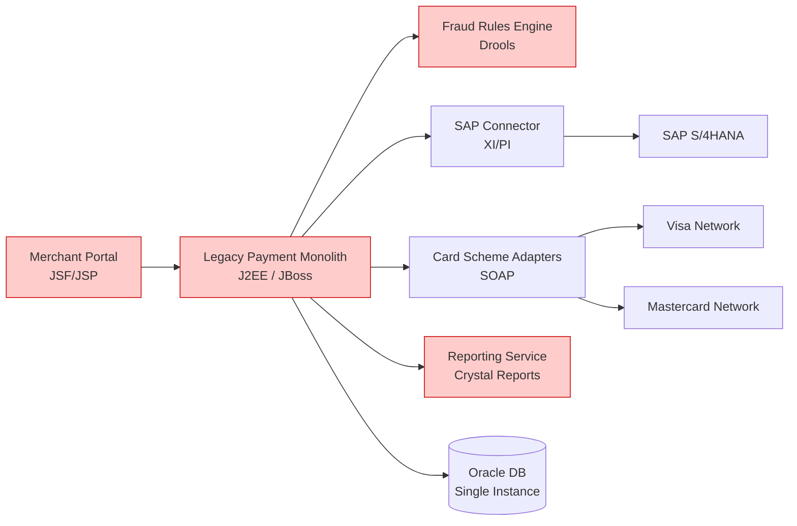
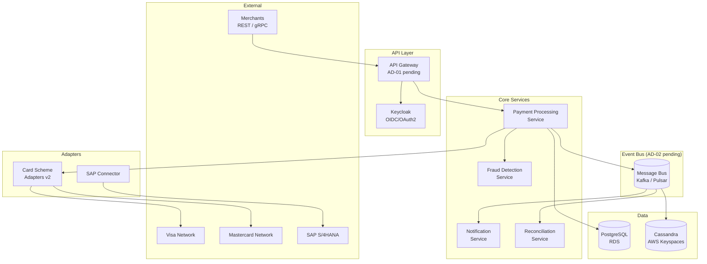

# C1 — Application Architecture

## Baseline (As-Is) Architecture

The current PayPath platform is a monolithic J2EE application deployed on-premises with point-to-point integrations.

### Current Application Components

| ID | Component | Technology | Role | Status |
|----|-----------|-----------|------|--------|
| APP-01 | Legacy Payment Monolith | J2EE / JBoss 6 | Core payment processing | EOL Q4 2026 |
| APP-02 | Fraud Rules Engine | Drools (on-prem) | Batch fraud scoring | To be replaced |
| APP-03 | Merchant Portal | JSF / JSP | Merchant self-service | To be replaced |
| APP-04 | Reporting Service | Crystal Reports / Oracle | Reconciliation & reporting | To be replaced |
| APP-05 | SAP Connector | SAP XI/PI | ERP integration | To be retained |
| APP-06 | Card Scheme Adapters | Custom SOAP | Visa/Mastercard connectivity | To be rebuilt |

---

## Target Architecture

Cloud-native, event-driven microservices on Kubernetes with centralised API gateway and message bus.

### Target Application Components

| ID | Component | Technology | Role | Migration |
|----|-----------|-----------|------|-----------|
| NEW-01 | API Gateway | TBD (see AD-01) | Single entry point for all merchant APIs | 🟢 New |
| NEW-02 | Payment Processing Service | Go / gRPC | Core transaction orchestration | 🟢 New |
| NEW-03 | Fraud Detection Service | Python / FastAPI | Real-time ML inference < 200ms | 🟢 New |
| NEW-04 | Merchant Portal (SPA) | React / TypeScript | Merchant self-service | 🟢 New |
| NEW-05 | Notification Service | Node.js | Webhooks, email, SMS | 🟢 New |
| NEW-06 | Reconciliation Service | Python | Daily settlement & reporting | 🟢 New |
| NEW-07 | Card Scheme Adapters v2 | Go | REST/ISO 20022 connectivity | 🟢 New |
| NEW-08 | Identity & Access | Keycloak (OIDC) | OAuth2, merchant auth | 🟢 New |
| RET-01 | SAP Connector | SAP PI/PO (upgraded) | ERP integration — retained | 🔵 Keep |
| DEP-01 | Legacy Payment Monolith | J2EE / JBoss | Decommission post-migration | 🔴 Remove |
| DEP-02 | Fraud Rules Engine | Drools | Replaced by NEW-03 | 🔴 Remove |
| DEP-03 | Reporting (Crystal Reports) | Crystal Reports | Replaced by NEW-06 | 🔴 Remove |

---

## Gap Analysis

| Gap | Current State | Target State | Action |
|-----|--------------|-------------|--------|
| API layer | No API gateway — direct SOAP calls | Centralised REST/gRPC gateway | Implement NEW-01 (AD-01) |
| Fraud detection | Batch T+1 rules | Real-time ML < 200ms | Implement NEW-03 |
| Event streaming | Point-to-point sync calls | Async event bus | Implement AD-02 |
| Identity | Basic OAuth in monolith | Centralised OIDC (Keycloak) | Implement NEW-08 |
| Observability | Siloed logs, no tracing | OpenTelemetry unified | Implement per service |

---

## Dependencies

| ID | Dependency | From | To | Type |
|----|-----------|------|----|------|
| DEP-01 | API Gateway decision | NEW-01 | AD-01 | Blocked by decision |
| DEP-02 | Message bus selection | NEW-02, NEW-06 | AD-02 | Blocked by decision |
| DEP-03 | Fraud ML model | NEW-03 | Data Science team | External dependency |
| DEP-04 | PCI-DSS tokenisation | NEW-02 | R-03 mitigation | Risk dependency |
| DEP-05 | Keycloak integration | NEW-08 | IT Security (Luca De Santis) | Stakeholder approval needed |

---

## Open Architecture Questions

- [[X3_Open_Questions#Q-01]] — Should the API Gateway enforce PCI payload inspection or delegate to the payment service?
- [[X3_Open_Questions#Q-02]] — Co-locate Fraud Detection Service with Payment Processing or separate deployment?
- [[X1_ADR_Decision_Log#AD-01]] — API Gateway vendor still open
- [[X1_ADR_Decision_Log#AD-02]] — Message bus still open
