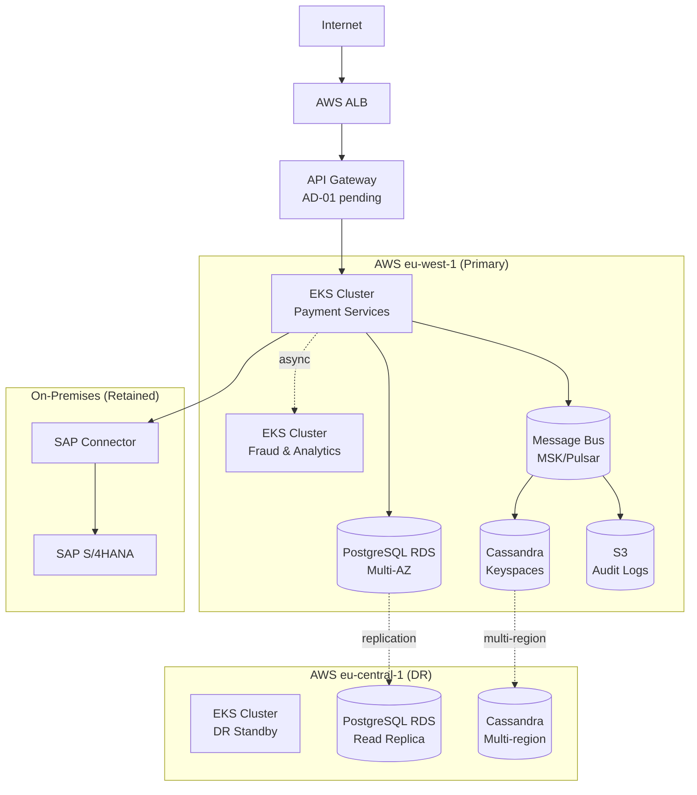

# D1 — Technology Architecture

> ⚠️ Status: **Draft** — pending API Gateway decision (AD-01) and multi-cloud decision (AD-03)

## Baseline (As-Is) Technology Stack

| Layer | Technology | Version | Location | Status |
|-------|-----------|---------|----------|--------|
| Application runtime | JBoss EAP | 6.4 | On-premises DC1 | EOL |
| Database | Oracle Database | 12c | On-premises DC1 | EOL |
| Integration | SAP XI/PI | 7.4 | On-premises DC1 | To upgrade |
| Security | F5 BIG-IP WAF | 14.x | On-premises DC1 | To migrate |
| Monitoring | Nagios + Splunk | — | On-premises DC1 | Fragmented |
| Network | MPLS + DC interconnect | — | On-premises DC1 | Retained |

---

## Target Technology Stack

### Compute & Orchestration

| Component | Technology | Decision | Notes |
|-----------|-----------|----------|-------|
| Container orchestration | Kubernetes (EKS) | ✅ Decided | AWS EKS primary |
| Container runtime | containerd | ✅ Decided | Default EKS |
| GitOps deployment | ArgoCD | ✅ Decided | P-07 principle |
| Service mesh | Istio | 🟡 Proposed | mTLS, traffic management |

### Networking & API

| Component | Technology | Decision | Notes |
|-----------|-----------|----------|-------|
| API Gateway | **TBD** | 🔴 AD-01 open | Kong / AWS APIM / Azure APIM |
| Internal service communication | gRPC + Istio mTLS | ✅ Decided | — |
| Async messaging | **TBD** | 🔴 AD-02 open | Kafka MSK / Pulsar |
| DNS & CDN | AWS Route 53 + CloudFront | ✅ Decided | — |
| Load balancer | AWS ALB | ✅ Decided | — |

### Data

| Component | Technology | Decision | Notes |
|-----------|-----------|----------|-------|
| Transactional DB | PostgreSQL (AWS RDS) | ✅ AD-04 decided | Multi-AZ |
| Event / time-series store | Cassandra (AWS Keyspaces) | ✅ AD-04 decided | — |
| Cache | Redis (ElastiCache) | ✅ Decided | Session, rate limit |
| Search | OpenSearch (AWS) | 🟡 Proposed | Merchant analytics |

### Security

| Component | Technology | Decision | Notes |
|-----------|-----------|----------|-------|
| Identity Provider | Keycloak / managed OIDC | 🟡 Q-04 open | Self-managed vs Auth0/Cognito |
| Secrets management | AWS Secrets Manager | ✅ Decided | P-02 principle |
| WAF | AWS WAF | ✅ Decided | COMP-03 |
| HSM / Tokenisation | **TBD** | 🔴 R-03 open | Thales vs AWS Payment Cryptography |
| Certificate management | AWS Certificate Manager | ✅ Decided | — |

### Observability

| Component | Technology | Decision | Notes |
|-----------|-----------|----------|-------|
| Distributed tracing | AWS X-Ray + Jaeger | ✅ Decided | OpenTelemetry SDK |
| Metrics | Prometheus + Grafana | ✅ Decided | — |
| Logging | AWS CloudWatch + OpenSearch | ✅ Decided | — |
| Alerting | PagerDuty | ✅ Decided | — |

---

## Infrastructure Topology

---

## Open Items

- **AD-01**: API Gateway vendor — blocks finalization of networking section
- **AD-02**: Message bus — blocks MSK vs Pulsar specification
- **AD-03**: Multi-cloud strategy — determines DR complexity and Azure inclusion
- **Q-04**: Keycloak self-managed vs managed OIDC

**Blocked until:** AD-01 resolved (target 2026-03-01)
