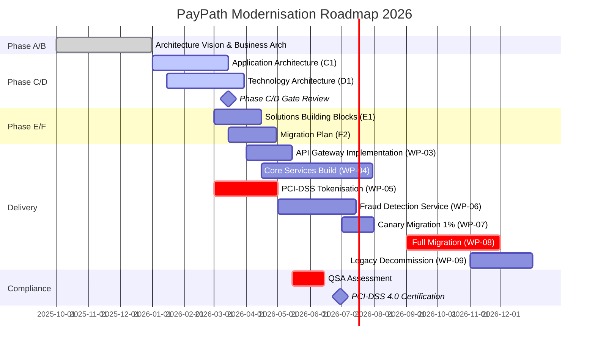
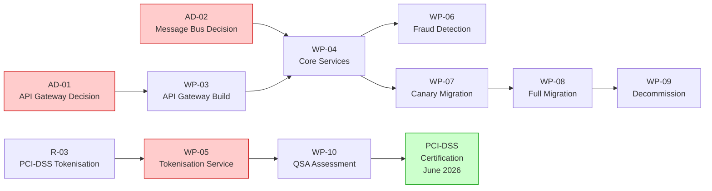

# F1 — Architecture Roadmap

## Programme Timeline

---

## Work Package Summary

| ID | Work Package | Phase | Status | Owner | Target | Depends On |
|----|-------------|-------|--------|-------|--------|-----------|
| WP-01 | Architecture Vision & Governance | A | ✅ Done | V. Marafioti | 2025-12-31 | — |
| WP-02 | Business Architecture & Scenarios | B | ✅ Done | Payments Lead | 2025-12-31 | WP-01 |
| WP-03 | API Gateway Platform | C/D | 🟡 Planned | Platform Team | 2026-05-15 | AD-01 |
| WP-04 | Core Microservices Build | E | 🟡 Planned | Engineering | 2026-07-31 | WP-03, AD-02 |
| WP-05 | PCI-DSS Tokenisation Service | C | 🔴 Critical | Security Team | 2026-05-01 | R-03 |
| WP-06 | Fraud Detection Service | C/E | 🟡 Planned | Data Science | 2026-07-15 | WP-04 |
| WP-07 | Canary Migration (1% traffic) | F | 🔵 Future | Platform Team | 2026-08-01 | WP-04, WP-05 |
| WP-08 | Full Platform Migration | F | 🔵 Future | All Teams | 2026-11-30 | WP-07 |
| WP-09 | Legacy Decommission | H | 🔵 Future | Platform Team | 2026-12-31 | WP-08 |
| WP-10 | QSA Compliance Assessment | G | 🔴 Critical | Security Team | 2026-06-15 | WP-05 |

---

## Critical Path

---

## Milestones

| Date | Milestone | Status |
|------|-----------|--------|
| 2025-12-31 | Phase A/B complete | ✅ Achieved |
| 2026-03-15 | Phase C/D gate review | 🟡 Upcoming |
| 2026-05-01 | Tokenisation service live | 🔴 At risk |
| 2026-06-30 | PCI-DSS 4.0 certification | 🔴 At risk |
| 2026-08-01 | Canary migration start | 🟡 On track (conditional) |
| 2026-11-30 | Full migration complete | 🟡 On track (conditional) |
| 2026-12-31 | Legacy decommission | 🟡 On track (conditional) |

## Status Legend
- **Not started** — Work not yet begun
- **In progress** — Actively being worked on
- **Blocked** — Cannot proceed; dependency or issue outstanding
- **Complete** — Delivered and verified
- **Deferred** — Postponed to a later phase
