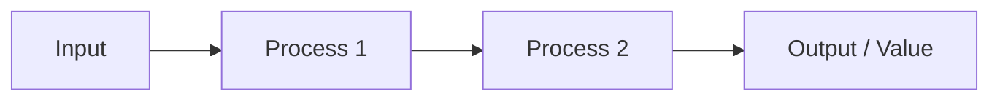

# Value Chain & Motivation

> Phase A — Business motivation model and value chain mapping.

## Business Motivation

| Element | Description |
|---------|-------------|
| Vision | |
| Mission | |
| Strategy | |
| Tactic | |
| Goal | |
| Objective | |

## Value Stream

(Describe or diagram the end-to-end value stream this initiative supports)

