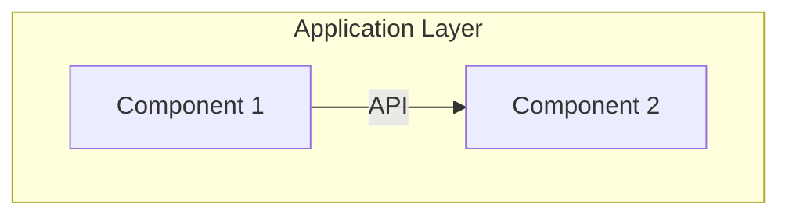

# Application Architecture

> Phase C — Application components, interfaces, and interactions.

## Baseline Application Landscape

(Current applications and services)

## Target Application Architecture

### Logical Components

| Component | Purpose | Interfaces | Owner |
|-----------|---------|------------|-------|
| | | | |

### Interaction Diagram

## Gap Analysis

| Baseline | Target | Gap | Action |
|----------|--------|-----|--------|
| | | | |
