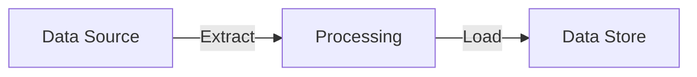

# Data Architecture

> Phase C — Data entities, flows, governance, and quality.

## Data Entity Catalog

| Entity | Classification | Owner | Storage | Retention |
|--------|---------------|-------|---------|-----------|
| | PII / Internal / Public | | | |

## Classification Legend
- **PII** — Personally Identifiable Information (subject to GDPR / privacy regulations)
- **Confidential** — Internal-only, restricted access, business-sensitive
- **Internal** — General internal use, no regulatory constraints
- **Public** — Openly available, no access restrictions

## Data Flow Diagram

## Data Governance

| Policy | Description | Status |
|--------|-------------|--------|
| Data Residency | | TBD |
| Encryption at Rest | | TBD |
| Encryption in Transit | | TBD |
| Retention | | TBD |
| PII Handling | | TBD |

## Data Quality Rules

- 
